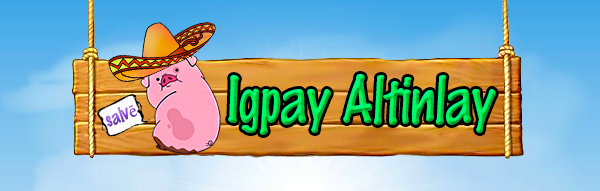

# Igpay Atinlay ( Pig Latin )

**Table of Contents**
- [What is Igpay Atinlay?](#what-is-igpay-atinlay)
- [How to play?](#how-to-play)
- [How to install?](#how-to-install-the-game)
- [What does we learn?](#what-does-we-learn-from-doing-this-project)
- [Contributors](#contributors)

## What is Igpay Atinlay?
This application is a language game that words in English are altered by adding a fabricated suffix or by moving the onset or initial consonant or consonant cluster of a word to the end of the word and adding a vocalic syllable to create such a suffix.
    

## How to play?
**1.** Click **Start** button

**2.** Type your name then click :arrow_right: button (or click :arrow_left: button to go back to main menu )

**3.** Select level you want to play (If you want to change player name click :arrow_left: button)

- **Easy**

    In easy level, we'll give a word and choices for players. The players need to choose a correct answer and type letter into the answer box.
    **Score:**
    For easy level -  this level contains 10 questions with 10 points each. Full score is 100 points.
        

        
- **Medium**

    In medium level, we'll only give a word to players and the players need to type a correct answer into the answer box below.
    **Score:**
    For medium level - this level contains 10 questions with 50 points each. Full score is 500 points.
    

    
- **Hard**

    In hard level, we'll give a phrase or a sentence to players and the players need to type a correct answer into the answer box below.
    **Score:**
    For hard level - this level contains 5 questions with 200 points each. Full score is 1000 points.
        

        
    
### Score Info 
Score Info will show correct and wrong problems amount of players, name score and some word depends on the score that players got.
    

    
### More buttons features :
- click **Help** button to read described of the game and see some examples.
- click **About** button to read credits of the game.
- click **Restart** button to restart the game with level you're selected before.
- click **Main** button to go back to main menu of the game.
- click **New Game** button to have new game (link back to input player's name window).
- click **Exit** button to exit the game.

## How to install the game?
### Installation
To run and play this program, your computer need:
 - Java version 8 or newer
 - IgpayAtinlay.jar
 
 ### How to run
 1. Download runnable IgpayAtinlay.jar file by click at 'IgpayAtinlay.jar' file above then click download.
 2. Runs IgpayAtinlay.jar file.

## What does we learn from doing this project?

## Contributors
   - [**Kunyaruk Katebunlu**](https://github.com/NokKbl) (ID: 6010545692)
   - [**Vichakorn Yotboonrueang**](https://github.com/Newaz2542) (ID: 6010545889)
   
**Note**
    This game application is a project of Programming 1 course for the first semester which created by students in Faculty of Software and Knowledge Engineering, Kasetsart University.
